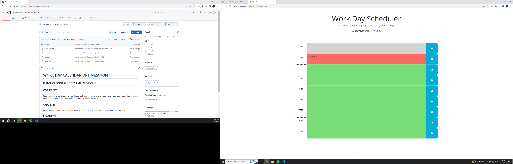

# WORK DAY CALENDAR OPTIMIZATION 

## RUTGERS CODING BOOTCAMP PROJECT-5

## OVERVIEW 
Create a day calendar to store events throughout your day using local storage. Have a date using Dayjs display at top of calendar and color sync past, present and future tasks in calendar.

## CHANGES
We committed changes to mostly the javascript file but also adding extra time blocks to the html only.

## FEATURES
- Local Storage
- Dynamic changing date 
- Ability to save data when refreshed

https://armond-guze.github.io/work-day-calendar/

